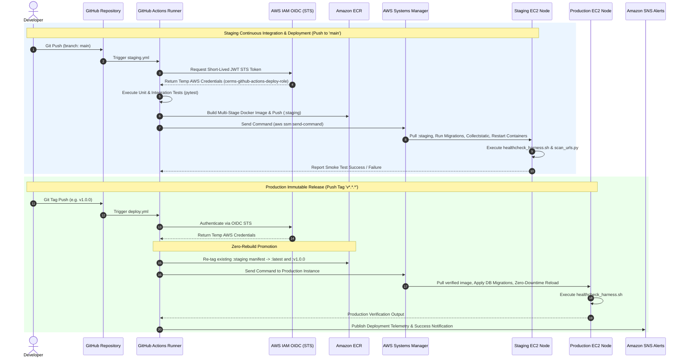

# 05_DEVOPS_AND_CLOUD

# Construction Equipment Rental Management System (CERMS)
## Enterprise DevOps, Infrastructure & Cloud Architecture Blueprint

---

## 1. Executive Summary & Dual-Environment Strategy

The **Construction Equipment Rental Management System (CERMS)** is designed to operate on an enterprise-grade, zero-trust cloud infrastructure on Amazon Web Services (AWS) during staging, continuous integration, and production phases, while maintaining strict architectural parity with cPanel/bare-metal deployment targets.

### Core Architectural Pillars
- **Zero-Trust Security & Bastionless Access:** Elimination of static SSH keys and traditional jump hosts. All server management and CI/CD operations are brokered through AWS Systems Manager (SSM) and OpenID Connect (OIDC).
- **Environment Parity & Containerization:** Strict encapsulation using Docker Compose on an isolated `172.28.0.0/16` bridge network (`cerms_net`), eliminating configuration drift across local, staging, and production environments.
- **Immutable Release Promotion:** Zero-rebuild deployment model where the exact binary image validated in staging is cryptographically promoted to production.
- **Multi-Tenant Scoped Disaster Recovery:** Non-blocking atomic database snapshots, symmetrically encrypted in-stream via AES-256 GPG, stored within isolated S3 tenant namespaces (`tenant-b-cerms`), and governed by FinOps Glacier tiering.

---

## 2. AWS Cloud Infrastructure Architecture

```mermaid
graph TB
    subgraph Global_Edge["Global Edge & Ingress Layer (AWS Edge)"]
        CF["AWS CloudFront CDN<br/>(TLS 1.2 / 1.3 Termination, SSL Edge Caching)"]
        ACM["AWS ACM Certificate Manager<br/>(us-east-1 SSL Certificates)"]
        ACM -.-> CF
    end

    subgraph AWS_VPC["Dedicated Multi-Tenant VPC: 10.10.0.0/16 (cerms-dedicated-vpc)"]
        IGW["Internet Gateway (cerms-igw)<br/>0.0.0.0/0 Ingress/Egress"]
        
        subgraph Prod_Subnet["Production Subnet: 10.10.1.0/24 (ap-south-1a)"]
            EC2_PROD["EC2 Production Node<br/>(AWS Graviton2 ARM64 / x86_64 Debian)"]
            
            subgraph Docker_Prod["Docker Bridge Network: 172.28.0.0/16 (cerms_net)"]
                NGINX_P["cerms_nginx<br/>Reverse Proxy (:80 / :443)"]
                WEB_P["cerms_web<br/>Django + Gunicorn (:8000)"]
                CELERY_P["cerms_celery<br/>Async Background Worker"]
                REDIS_P["cerms_redis<br/>Cache & Broker (:6379)"]
                DB_P["cerms_mariadb<br/>MariaDB 10.11 LTS (:3306)"]
                
                NGINX_P -->|Proxy Pass :8000| WEB_P
                WEB_P --> DB_P
                WEB_P --> REDIS_P
                CELERY_P --> DB_P
                CELERY_P --> REDIS_P
            end
            EC2_PROD --- NGINX_P
        end

        subgraph Stage_Subnet["Staging Subnet: 10.10.2.0/24 (ap-south-1b)"]
            EC2_STAGE["EC2 Staging Node<br/>(Isolated QA & Verification)"]
        end

        IGW -->|Port 80/443 Only| EC2_PROD
        IGW -->|Port 80/443 Only| EC2_STAGE
    end

    subgraph Storage_Governance["Centralized Storage & Governance (AWS Services)"]
        ECR["Amazon ECR<br/>(cerms-web-repo)"]
        S3_DR["Central S3 Disaster Recovery<br/>(Encrypted Bucket: tenant-b-cerms/)"]
        GLACIER["AWS S3 Glacier<br/>(Automated 30-Day Transition)"]
        CW["AWS CloudWatch<br/>(Metrics, Alarms & Logs)"]
        SNS["Amazon SNS<br/>(DevOps Incident Notifications)"]

        S3_DR -->|FinOps Lifecycle Rule (30d)| GLACIER
        EC2_PROD -.->|Nightly Encrypted Backup (AES-256)| S3_DR
        EC2_PROD -.->|Host Telemetry & Metrics| CW
        CW -->|Alarm Threshold Breached| SNS
    end

    CF -->|Origin Dynamic Request| IGW
```

### 2.1 Network Topology & VPC CIDR Design
- **Virtual Private Cloud (VPC):** `10.10.0.0/16` (`cerms-dedicated-vpc`) dedicated to enterprise rental operations with DNS Support and DNS Hostnames enabled.
- **Production Subnet:** `10.10.1.0/24` deployed in Availability Zone `ap-south-1a` (`cerms-production-subnet`).
- **Staging Subnet:** `10.10.2.0/24` deployed in Availability Zone `ap-south-1b` (`cerms-staging-subnet`) for complete physical isolation of pre-release workloads.
- **Internet Gateway & Route Table:** `cerms-igw` routed to `0.0.0.0/0` via `cerms-public-route-table` for public web traffic and outbound API connectivity (Mailgun, Twilio, AWS STS).

### 2.2 Global Edge Routing (AWS CloudFront & ACM)
- **CDN Edge Caching:** AWS CloudFront routes global user traffic, terminating SSL/TLS at edge locations using TLS 1.2 and TLS 1.3 modern cipher suites.
- **Static & Media Asset Offloading:**
  - Route `/static/*` requests to edge cache with a 30-day immutable cache TTL.
  - Route `/media/*` (equipment photos, contracts, inspection files) with a 7-day TTL.
- **Dynamic Ingress:** Forward all API and application requests to the EC2 origin while preserving `Host`, `X-Forwarded-For`, `X-Forwarded-Proto`, and `CloudFront-Forwarded-Proto` request headers.
- **SSL Certificate Provisioning:** Managed via AWS Certificate Manager (ACM) in `us-east-1` for global CloudFront distributions.

### 2.3 Compute & Bastionless Access Model
- **Compute Sizing:** AWS EC2 instances running Debian 12 (Bookworm) / Ubuntu 22.04 LTS on cost-efficient AWS Graviton2 (ARM64) or x86_64 architecture.
- **Zero-SSH Policy:** Security Group `cerms-production-sg` contains **NO ingress rule for Port 22**. SSH daemon access is blocked at the network perimeter.
- **AWS Systems Manager (SSM) Session Manager:** All shell access, diagnostic commands, and automated CI/CD script execution run via the AWS SSM Agent using IAM instance role `cerms-ec2-ssm-role` with `AmazonSSMManagedInstanceCore`.

---

## 3. Container Orchestration & Docker Architecture

CERMS runs on a containerized micro-architecture managed via Docker Compose and bound to an isolated bridge network.

```text
Host System (EC2 / Bare Metal)
│
└── Docker Bridge Network: cerms_net (172.28.0.0/16)
    ├── [cerms_nginx]    - Ingress Reverse Proxy (Ports: 80, 443)
    ├── [cerms_web]      - Django 5.x + Gunicorn WSGI (Internal Port: 8000)
    ├── [cerms_celery]   - Asynchronous Task Worker (Invoice PDF, SMS, Fleet Cron)
    ├── [cerms_redis]    - Redis 7.2 Cache & Message Broker (Internal Port: 6379)
    └── [cerms_mariadb]  - MariaDB 10.11 LTS InnoDB Engine (Internal Port: 3306)
```

### 3.1 Container Service Topology & Resource Quotas

| Service Container | Base Image | Internal Port | Host Port | Memory Limit | Volume Mappings | Healthcheck / Readiness |
| :--- | :--- | :--- | :--- | :--- | :--- | :--- |
| **`cerms_nginx`** | `nginx:1.25-alpine` | `80`, `443` | `80:80`, `443:443` | 150 MB | `static_data:/var/www/static:ro`<br/>`media_data:/var/www/media:ro`<br/>`./certs:/etc/nginx/certs:ro`<br/>`./nginx.conf:/etc/nginx/conf.d/default.conf:ro` | HTTP `/healthz` probe returning `200 OK` |
| **`cerms_web`** | `python:3.12-slim-bookworm` (Multi-stage) | `8000` | None (Internal) | 1200 MB | `static_data:/app/collected_static`<br/>`media_data:/app/media` | Gunicorn socket bind & HTTP `/healthz` |
| **`cerms_celery`** | `python:3.12-slim-bookworm` (Multi-stage) | None | None | 600 MB | `media_data:/app/media` | Celery inspect ping via Redis broker |
| **`cerms_redis`** | `redis:7.2-alpine` | `6379` | None (Internal) | 200 MB | Internal Ephemeral / AOF | `redis-cli ping` returning `PONG` |
| **`cerms_mariadb`** | `mariadb:10.11` | `3306` | None (Internal) | 500 MB | `mariadb_data:/var/lib/mysql` | `mariadb-admin ping` check |

### 3.2 Multi-Stage Docker Build Standard

To ensure minimal image size and eliminate build-chain attack vectors in production:

```dockerfile
# STAGE 1: Compilation & Dependency Builder
FROM python:3.12-slim-bookworm AS builder
WORKDIR /build
RUN apt-get update && apt-get install -y --no-install-recommends \
    build-essential pkg-config default-libmysqlclient-dev libjpeg-dev \
    libffi-dev libpango1.0-dev libgdk-pixbuf2.0-dev shared-mime-info \
    && rm -rf /var/lib/apt/lists/*
COPY requirements.txt .
RUN pip install --no-cache-dir --prefix=/usr/local -r requirements.txt

# STAGE 2: Hardened Runtime Container
FROM python:3.12-slim-bookworm
WORKDIR /app
# Threading restrictions prevent CPU thrashing on multi-tenant cloud cores
ENV PYTHONDONTWRITEBYTECODE=1 PYTHONUNBUFFERED=1 \
    OPENBLAS_NUM_THREADS=1 OMP_NUM_THREADS=1 MKL_NUM_THREADS=1
RUN apt-get update && apt-get install -y --no-install-recommends \
    libmariadb3 libjpeg62-turbo libpango-1.0-0 libpangoft2-1.0-0 \
    libharfbuzz0b shared-mime-info fontconfig curl \
    && rm -rf /var/lib/apt/lists/*
COPY --from=builder /usr/local /usr/local
COPY . /app
RUN useradd -u 1000 -U -s /bin/bash -m cerms_user && \
    mkdir -p /app/collected_static /app/media && \
    chown -R cerms_user:cerms_user /app
USER cerms_user
EXPOSE 8000
CMD ["gunicorn", "cerms_project.wsgi:application", "--bind", "0.0.0.0:8000", "--workers", "3", "--threads", "2"]
```

---

## 4. Zero-Trust CI/CD Automation (GitHub Actions)

Deployments are fully automated, passwordless, and strictly segregated between staging and production environments.



### 4.1 Key CI/CD Architectural Guarantees
1. **Passwordless IAM Authentication (OIDC):** Long-lived AWS access keys are forbidden in GitHub Secrets. GitHub Actions authenticates directly against AWS IAM using OIDC STS (`token.actions.githubusercontent.com:aud = "sts.amazonaws.com"`) assuming `cerms-github-actions-deploy-role`.
2. **Zero-Rebuild Immutable Promotion:** Production releases **NEVER recompile or rebuild code**. The pipeline pulls the exact digest of the container image tested in staging, validates its cryptographic hash, and promotes it with the release tag (e.g., `v1.2.0`). This guarantees 100% environment parity.
3. **Automated Smoke Testing Harness:** Post-deployment hooks execute `scan_urls.py` and `healthcheck_harness.sh` to verify HTTP status codes across all authenticated endpoints and database connection pools before finalizing the deployment.

---

## 5. Multi-Tenant S3 Disaster Recovery & Hot Backup Pipeline

### 5.1 Multi-Tenant Backup Architecture
Backups are orchestrated automatically by an EC2 cron daemon and pushed to a centralized, encrypted S3 bucket.

- **Centralized S3 Bucket:** `cerms-central-enterprise-backups-<hash>`
- **Tenant Prefix Scoping:** `tenant-b-cerms/db/YYYY/MM/`
- **IAM Scoping Rule:** The EC2 IAM role (`cerms-ec2-s3-backup-policy`) is restricted via least-privilege policies to **ONLY** read/write within `tenant-b-cerms/*`. Access to other tenant prefixes in the bucket is explicitly denied.

```mermaid
graph LR
    subgraph Host_EC2["EC2 Production Host"]
        CRON["Cron Daemon (02:00 AM)"]
        DUMP["mariadb-dump<br/>(--single-transaction)"]
        GZIP["Gzip Stream Compression"]
        GPG["GPG In-Stream Encryption<br/>(AES-256 Symmetric)"]
        AWS_CLI["AWS S3 CLI Stream Transfer"]

        CRON --> DUMP
        DUMP -->|Pipe stdout| GZIP
        GZIP -->|Pipe stdout| GPG
        GPG -->|Encrypted .sql.gz.gpg| AWS_CLI
    end

    subgraph AWS_Storage["Central Disaster Recovery S3"]
        S3_HOT["S3 Standard<br/>Prefix: tenant-b-cerms/db/"]
        S3_COLD["S3 Glacier Flexible Retrieval<br/>(Cold Archive)"]
        EXP["Automated Expiration<br/>(Day 365)"]

        AWS_CLI -->|Direct IAM Upload| S3_HOT
        S3_HOT -->|FinOps Rule: Transition after 30 Days| S3_COLD
        S3_COLD -->|Retention Purge after 365 Days| EXP
    end
```



### 5.2 Atomic Hot Backup Script (`nightly_db_backup.sh`)

```bash
#!/usr/bin/env bash
set -euo pipefail

# ==============================================================================
# CERMS - Production Offsite Disaster Recovery Daemon
# Encrypted Non-Blocking Atomic Dump -> S3 Multi-Tenant Cold Storage
# ==============================================================================

TIMESTAMP=$(date +"%Y%m%d_%H%M%S")
YEAR=$(date +"%Y")
MONTH=$(date +"%m")

BACKUP_DIR="/tmp/cerms_backups"
S3_BUCKET="${BACKUP_S3_BUCKET:-cerms-central-enterprise-backups}"
S3_PREFIX="tenant-b-cerms/db/${YEAR}/${MONTH}"
GPG_PASSPHRASE="${BACKUP_GPG_KEY:?Error: BACKUP_GPG_KEY is required}"

mkdir -p "${BACKUP_DIR}"
DUMP_FILE="${BACKUP_DIR}/cerms_db_${TIMESTAMP}.sql.gz.gpg"

echo "[$(date)] Initiating atomic non-blocking database snapshot for CERMS..."

# 1. Non-blocking InnoDB consistent dump via container socket
# 2. In-stream Gzip compression
# 3. In-stream AES-256 Symmetric GPG Encryption (Zero plaintext on disk)
docker exec cerms_mariadb mariadb-dump \
  -u root -p"${DB_PASSWORD}" \
  --single-transaction \
  --quick \
  --all-databases \
  2>/dev/null | gzip -c | gpg --symmetric --batch --yes --passphrase "${GPG_PASSPHRASE}" --cipher-algo AES256 -o "${DUMP_FILE}"

echo "[$(date)] Snapshot successfully generated and encrypted: ${DUMP_FILE}"

# 4. Upload to isolated tenant namespace in central S3 bucket using EC2 IAM Role
aws s3 cp "${DUMP_FILE}" "s3://${S3_BUCKET}/${S3_PREFIX}/cerms_db_${TIMESTAMP}.sql.gz.gpg" --region ap-south-1

echo "[$(date)] Backup uploaded to S3: s3://${S3_BUCKET}/${S3_PREFIX}/cerms_db_${TIMESTAMP}.sql.gz.gpg"

# 5. Clean temporary local artifacts
rm -f "${DUMP_FILE}"
echo "[$(date)] Temporary local files purged. Disaster Recovery execution completed."
```

### 5.3 Disaster Recovery Metrics & SLAs

| Metric | Target SLA | Implementation Strategy |
| :--- | :--- | :--- |
| **Recovery Point Objective (RPO)** | `< 24 Hours` (Nightly Dump) | Nightly hot backup automated at 02:00 AM UTC with transaction log preservation. |
| **Recovery Time Objective (RTO)** | `< 30 Minutes` | Automated S3 retrieval, GPG decryption, and Docker database container re-import script. |
| **Encryption Standard** | AES-256 GPG + SSE-S3 | Double-layer encryption (In-flight GPG symmetric cipher + At-rest AWS S3 SSE). |
| **Storage Lifecycle** | S3 Standard (Days 1–30)<br/>S3 Glacier (Days 31–365) | S3 Lifecycle configuration rule `archive-cerms-db-to-glacier`. |

---

## 6. Network Security, Firewall Rules & Port Matrix

All ingress and egress traffic is strictly controlled through AWS Security Groups and container port-binding boundaries.

```text
External Internet
   │
   ├── [Port 80  - HTTP]  ──> [AWS CloudFront / Nginx Ingress]  (OPEN - Redirects to HTTPS)
   ├── [Port 443 - HTTPS] ──> [AWS CloudFront / Nginx Ingress]  (OPEN - TLS 1.2/1.3)
   │
   ├── [Port 22   - SSH]       ──> BLOCKED AT SECURITY GROUP (SSM Session Manager Only)
   ├── [Port 3306 - MariaDB]   ──> BLOCKED FROM EXTERNAL (Isolated to cerms_net)
   ├── [Port 6379 - Redis]     ──> BLOCKED FROM EXTERNAL (Isolated to cerms_net)
   └── [Port 8000 - Gunicorn]  ──> BLOCKED FROM EXTERNAL (Isolated to cerms_net)
```

### 6.1 Comprehensive Port & Security Matrix

| Layer / Service | Protocol | Port / Range | Source / Destination | Security Action | Justification |
| :--- | :--- | :--- | :--- | :--- | :--- |
| **Edge Ingress** | TCP | `80` | `0.0.0.0/0` | **ALLOW** | Standard HTTP traffic (Redirected to HTTPS / CloudFront origin). |
| **Edge Ingress** | TCP | `443` | `0.0.0.0/0` | **ALLOW** | Encrypted TLS HTTPS traffic terminated by CloudFront CDN / Nginx. |
| **Administrative Access** | TCP | `22` | Any | **DROP / BLOCK** | SSH completely blocked. All access governed via AWS SSM. |
| **Django WSGI Application** | TCP | `8000` | `cerms_net` | **INTERNAL ONLY** | Gunicorn bound to `0.0.0.0:8000` inside `cerms_net` Docker bridge. |
| **Database Tier** | TCP | `3306` | `cerms_net` | **INTERNAL ONLY** | MariaDB port not exposed to host or internet. Accessible only by `cerms_web` & `cerms_celery`. |
| **Redis Cache / Broker** | TCP | `6379` | `cerms_net` | **INTERNAL ONLY** | Redis port isolated within `cerms_net`. |
| **Outbound Egress** | ALL | `0.0.0.0/0` | Outbound | **ALLOW** | Required for S3 backup sync, OS security patches, SSM agent, and SMS/Email APIs. |

---

## 7. Observability, Monitoring & Health Probes

### 7.1 CloudWatch Metrics & Alert Thresholds
- **Host Metrics:** AWS CloudWatch monitors CPU utilization, RAM usage, and EBS disk IOPS.
  - **Alarm 1 - High CPU:** Breached if CPU Utilization exceeds **85% for 5 consecutive minutes**.
  - **Alarm 2 - Disk Space Critical:** Breached if EBS volume free space falls below **20%**.
  - **Alarm 3 - Container Heartbeat:** Breached if health check `/healthz` fails 3 times consecutively.
- **Incident Escalation:** CloudWatch Alarms trigger the `cerms-devops-alerts` SNS Topic, dispatching immediate email and mobile webhook alerts to the DevOps on-call engineers.

### 7.2 Container Production Healthcheck Harness (`healthcheck_harness.sh`)

```bash
#!/usr/bin/env bash
set -euo pipefail

echo "=================================================="
echo "CERMS Platform - Production Healthcheck Harness"
echo "=================================================="

ERRORS=0

# 1. Container State Verification
echo -n "[*] Verifying Docker Containers... "
RUNNING=$(docker ps --format '{{.Names}}')
for container in cerms_mariadb cerms_redis cerms_web cerms_celery cerms_nginx; do
  if echo "$RUNNING" | grep -q "$container"; then
    echo -n "$container(OK) "
  else
    echo -e "\n[-] FAILURE: Container $container is NOT running!"
    ERRORS=$((ERRORS + 1))
  fi
done
echo ""

# 2. Redis Cache & Broker Verification
echo -n "[*] Verifying Redis Service... "
REDIS_PING=$(docker exec cerms_redis redis-cli ping 2>/dev/null || echo "FAIL")
if [ "$REDIS_PING" = "PONG" ]; then
  echo "OK (PONG received)"
else
  echo "FAILED (Redis not responding)"
  ERRORS=$((ERRORS + 1))
fi

# 3. MariaDB Engine & Charset Verification
echo -n "[*] Verifying MariaDB UTF8MB4 & InnoDB Engine... "
DB_CHECK=$(docker exec cerms_mariadb mariadb -u root -p"${DB_PASSWORD}" "${DB_NAME}" -e "
  SELECT @@character_set_database AS charset, @@collation_database AS collation;
" 2>/dev/null | grep -E "utf8mb4" || true)

if [ -n "$DB_CHECK" ]; then
  echo "OK (utf8mb4 detected)"
else
  echo "FAILED (MariaDB charset validation error)"
  ERRORS=$((ERRORS + 1))
fi

# 4. Web Application Health Endpoint (/healthz)
echo -n "[*] Verifying Django Gunicorn Backend (/healthz)... "
HTTP_CODE=$(curl -s -o /dev/null -w "%{http_code}" http://127.0.0.1:8000/healthz || echo "000")
if [ "$HTTP_CODE" = "200" ] || [ "$HTTP_CODE" = "302" ]; then
  echo "OK (HTTP $HTTP_CODE)"
else
  echo "FAILED (Received HTTP $HTTP_CODE)"
  ERRORS=$((ERRORS + 1))
fi

# 5. Nginx Ingress Proxy Verification
echo -n "[*] Verifying Nginx Ingress Proxy (Port 80/443)... "
NGINX_CODE=$(curl -s -o /dev/null -w "%{http_code}" http://localhost/healthz || echo "000")
if [ "$NGINX_CODE" = "200" ]; then
  echo "OK (HTTP $NGINX_CODE)"
else
  echo "FAILED (Nginx Ingress HTTP $NGINX_CODE)"
  ERRORS=$((ERRORS + 1))
fi

echo "=================================================="
if [ "$ERRORS" -eq 0 ]; then
  echo "[SUCCESS] All CERMS health checks passed with ZERO errors!"
  exit 0
else
  echo "[FAILURE] $ERRORS health checks failed!"
  exit 1
fi
```

---

## 8. Operational Runbooks & Disaster Recovery Restoration

### 8.1 Administrative Terminal Access (AWS SSM)
Connect to the production or staging instance securely without SSH keys:
```bash
# Connect to production node via AWS CLI
aws ssm start-session --target i-0328a5a8e6e95e250 --region ap-south-1

# Switch to the application context
sudo su - cerms_user
cd /app
```

### 8.2 Disaster Recovery Database Restoration Procedure
In the event of database corruption, ransomware, or host failure:
```bash
# 1. Retrieve the latest encrypted snapshot from S3
aws s3 cp s3://cerms-central-enterprise-backups/tenant-b-cerms/db/2026/10/cerms_db_20261004_020000.sql.gz.gpg /tmp/restore.sql.gz.gpg

# 2. Decrypt with GPG Symmetric Passphrase and Decompress
gpg --decrypt --batch --passphrase "${BACKUP_GPG_KEY}" /tmp/restore.sql.gz.gpg | gunzip > /tmp/cerms_restore.sql

# 3. Stream restore into the isolated MariaDB container
docker exec -i cerms_mariadb mariadb -u root -p"${DB_PASSWORD}" "${DB_NAME}" < /tmp/cerms_restore.sql

# 4. Purge unencrypted SQL dump from host storage
rm -f /tmp/restore.sql.gz.gpg /tmp/cerms_restore.sql

# 5. Restart application services
docker compose restart web celery
```
