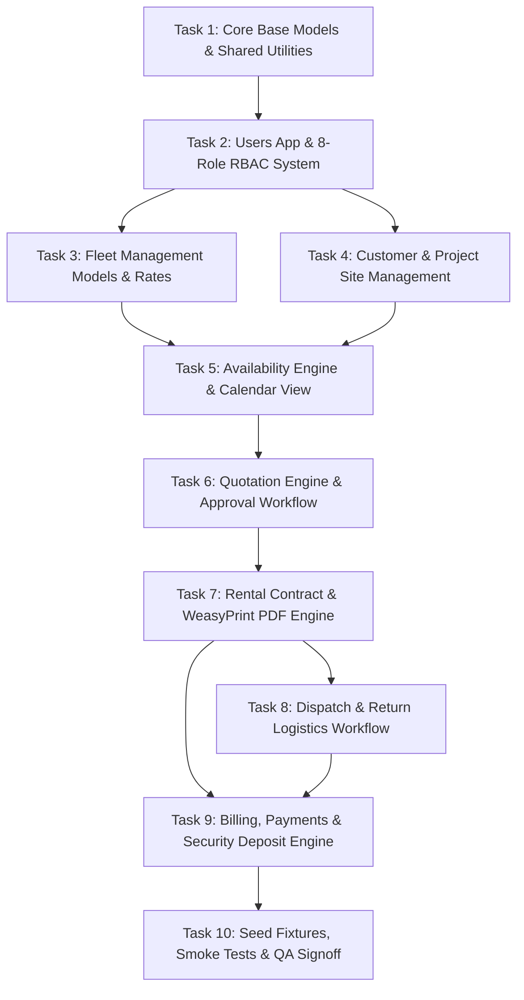

# 23_PHASE_1_ROADMAP

# CERMS: Phase 1 — Core System Modules Implementation Roadmap

**Document Target:** Phase 1 Detailed Architectural & Development Specification  
**Architecture:** Django 5+ Monolith | MariaDB 10.11 LTS | Bootstrap 5.3 | WeasyPrint | Django REST Framework (DRF) | Dual-Environment (AWS Cloud & cPanel Ready)  
**Primary Focus:** Identity & RBAC, Fleet Management, Customer & Site Master, Complete Rental Lifecycle, and Billing/Deposit Financials.

---

## 1. Executive Summary & Architectural Overview

Phase 1 establishes the functional core of the Construction Equipment Rental Management System (CERMS). It transitions the project from infrastructure provisioning (Phase 0) to a fully operational business platform that handles equipment cataloging, customer on-boarding, rental quoting, contract execution, physical dispatch/return workflows, and initial financial settlements.

```
+----------------------------------------------------------------------------------------------------+
|                                      PHASE 1 CORE SYSTEM FLOW                                      |
+----------------------------------------------------------------------------------------------------+
|                                                                                                    |
|  [users]                   [fleet]                     [rentals]                   [finance]       |
|  Custom User Model  --->  Equipment Master   --->   Customer & Sites   --->   Invoices & Billing    |
|  8 RBAC Roles             Categories & Rates        Quotations                Payments & Deposits  |
|  Session & JWT Auth       Availability State        Rental Contracts          PDF Generation       |
|                                                     Dispatch & Return                              |
|                                                                                                    |
+----------------------------------------------------------------------------------------------------+
```

### Architectural Guarantees for Phase 1

1. **Separation of Concerns:** Strict enforcement of **Thin Views**, **Fat Models**, and an isolated **Service Layer (`services.py`)** for multi-model business logic (e.g., Quotation-to-Contract conversion).
2. **Zero Data Loss & Strict Data Integrity:** All critical business relationships must use `on_delete=models.PROTECT` or `models.SET_NULL`. `models.CASCADE` is strictly prohibited on operational data.
3. **Environment-Aware Operations:** All background tasks (e.g., PDF generation, status notifications) must execute synchronously or via Celery depending on `USE_CELERY` in `.env`.
4. **Auditability & Timestamping:** Every database model must inherit from a common `TimeStampedModel` (`created_at`, `updated_at`, and `created_by`).

---

## 2. Django Apps Architecture & Creation Order

To prevent circular dependencies and maintain clean boundaries, Phase 1 code must be structured across five distinct Django apps implemented in the following precise order:

```text
cerms/
├── users/           # App 0: Identity, Custom User Model & RBAC Engine
├── fleet/           # App 1: Equipment Master, Categories, Rental Rates & Stock
├── rentals/         # App 2: Customers, Project Sites, Quotations, Contracts, Dispatch/Return
├── finance/         # App 3: Invoicing, Payments, Security Deposits & Financial Records
└── core/ (common/)  # Shared Base Models, Utilities, Context Processors & Mixins
```

---

## 3. Step-by-Step Sequential Implementation Tasks



---

### Step 1: Foundation Setup — Core Base Models & Authentication (`users` App)

#### 1.1 `users` App Setup & Custom User Model

- **Goal:** Replace Django's default `auth.User` with a custom model supporting 8 enterprise roles and single-sign-on compatibility before creating any database tables.
- **Django Configuration:** Register `AUTH_USER_MODEL = 'users.User'` in `cerms_project/settings/base.py`.
- **Model Definition (`users/models.py`):**
  - `User(AbstractUser)`:
    - `id`: BigAutoField (Primary Key)
    - `email`: EmailField (unique=True, indexed)
    - `role`: CharField with 8 choices (`ADMINISTRATOR`, `MANAGEMENT`, `RENTAL_OFFICER`, `OPERATIONS_OFFICER`, `WORKSHOP_MANAGER`, `ACCOUNTANT`, `STOREKEEPER`, `FIELD_OFFICER`)
    - `phone_number`: CharField(max_length=20, blank=True)
    - `employee_id`: CharField(max_length=50, unique=True, null=True, blank=True)
    - `is_active`: BooleanField(default=True)
  - Helper properties: `is_rental_officer`, `is_management`, `is_accountant`, `is_field_officer`.

#### 1.2 RBAC Groups & Permission Matrix

- **Fixture Implementation (`users/fixtures/core_roles.json`):**
  - Create the 8 Django `Group` instances with granular model permissions (`add_quotation`, `change_quotation`, `view_contract`, etc.).
- **Security Utilities (`users/permissions.py`):**
  - Custom Class-Based View (CBV) Mixins: `RoleRequiredMixin(roles=[...])`, `ManagementOrAdminRequiredMixin`.
  - Custom Function Decorators: `@role_required(['RENTAL_OFFICER', 'ADMINISTRATOR'])`.
  - DRF API Permissions: `IsFieldOfficerUser`, `IsAccountantUser`.

#### 1.3 Authentication Endpoints & UI

- **Views & Templates (`users/views.py`):**
  - `LoginView`, `LogoutView`, `PasswordChangeView` with branded Bootstrap 5.3 styling.
  - JWT Authentication endpoints (`/api/v1/auth/token/`, `/api/v1/auth/token/refresh/`) for mobile field workers.

---

### Step 2: Fleet Master Data Management (`fleet` App)

#### 2.1 Models & Database Schema (`fleet/models.py`)

- **`Category`:**
  - `id`: AutoField
  - `name`: CharField(max_length=100, unique=True)
  - `code`: SlugField(max_length=20, unique=True) (e.g., `EXC` for Excavators, `GEN` for Generators)
  - `description`: TextField(blank=True)
- **`Equipment` (Asset Master):**
  - `asset_code`: CharField(max_length=50, primary_key=True) (e.g., `EQ-CAT-320-001`)
  - `equipment_name`: CharField(max_length=200)
  - `category`: ForeignKey(`Category`, on_delete=models.PROTECT, related_name='equipment_list')
  - `brand`: CharField(max_length=100)
  - `model_number`: CharField(max_length=100)
  - `serial_number`: CharField(max_length=100, unique=True)
  - `manufacture_year`: PositiveIntegerField()
  - `purchase_cost`: DecimalField(max_digits=12, decimal_places=2)
  - `purchase_date`: DateField()
  - `current_hour_meter`: DecimalField(max_digits=10, decimal_places=2, default=0.00)
  - `status`: CharField(max_length=20, choices=[
    (`AVAILABLE`, 'Available'),
    (`RESERVED`, 'Reserved'),
    (`ON_RENT`, 'On Rent'),
    (`MAINTENANCE`, 'Maintenance'),
    (`BREAKDOWN`, 'Breakdown'),
    (`INACTIVE`, 'Inactive')
    ], default='AVAILABLE', db_index=True)
  - `primary_image`: ImageField(upload_to='equipment/images/', null=True, blank=True)
  - `specifications`: JSONField(default=dict, blank=True)
- **`RentalRate`:**
  - `id`: BigAutoField
  - `equipment`: ForeignKey(`Equipment`, on_delete=models.PROTECT, related_name='rental_rates')
  - `hourly_rate`: DecimalField(max_digits=10, decimal_places=2, null=True, blank=True)
  - `daily_rate`: DecimalField(max_digits=10, decimal_places=2)
  - `weekly_rate`: DecimalField(max_digits=10, decimal_places=2, null=True, blank=True)
  - `monthly_rate`: DecimalField(max_digits=10, decimal_places=2, null=True, blank=True)
  - `overtime_hourly_rate`: DecimalField(max_digits=10, decimal_places=2, null=True, blank=True)
  - `minimum_rental_hours`: PositiveIntegerField(default=8)
  - `effective_from`: DateField(default=timezone.now)
  - `is_active`: BooleanField(default=True)

#### 2.2 Fleet Business Logic & UI Layer

- **Model Methods:**
  - `equipment.is_available_for_dates(start_date, end_date)`: Validates absence of conflicting active/reserved contracts.
  - `equipment.transition_status(new_status, user, notes)`: Audits state changes.
- **Views & Templates:**
  - `EquipmentListView`: Server-side DataTables with status badge filtering and category search.
  - `EquipmentDetailView`: Technical specs, rate card, historical rent log, and live status.
  - `EquipmentCreateUpdateView`: Form with Crispy Bootstrap 5 styling and dynamic rate card inline formsets.

---

### Step 3: Customer & Project Site Management (`rentals` App — Part 1)

#### 3.1 Customer & Site Models (`rentals/models.py`)

- **`Customer`:**
  - `customer_code`: CharField(max_length=50, primary_key=True) (e.g., `CUST-2026-001`)
  - `company_name`: CharField(max_length=200)
  - `contact_person`: CharField(max_length=150)
  - `phone`: CharField(max_length=20)
  - `email`: EmailField()
  - `billing_address`: TextField()
  - `vat_tax_number`: CharField(max_length=50, blank=True)
  - `credit_limit`: DecimalField(max_digits=12, decimal_places=2, default=0.00)
  - `current_outstanding_balance`: DecimalField(max_digits=12, decimal_places=2, default=0.00)
  - `status`: CharField(choices=[('ACTIVE', 'Active'), ('BLOCKED', 'Blocked'), ('INACTIVE', 'Inactive')], default='ACTIVE')
- **`ProjectSite`:**
  - `project_code`: CharField(max_length=50, primary_key=True) (e.g., `PRJ-COL-001`)
  - `customer`: ForeignKey(`Customer`, on_delete=models.PROTECT, related_name='project_sites')
  - `project_name`: CharField(max_length=200)
  - `site_address`: TextField()
  - `gps_coordinates`: CharField(max_length=100, blank=True) (e.g., `6.9271,79.8612`)
  - `site_contact_person`: CharField(max_length=150, blank=True)
  - `site_contact_phone`: CharField(max_length=20, blank=True)
  - `status`: CharField(choices=[('ACTIVE', 'Active'), ('COMPLETED', 'Completed')], default='ACTIVE')

#### 3.2 Customer Business Logic & Credit Limit Verification

- **Service Function (`rentals/services.py`):**
  - `validate_customer_credit_limit(customer, new_quotation_amount)`: Checks if `outstanding_balance + new_amount > credit_limit` and raises a validation warning or forces management approval.

#### 3.3 Frontend UI Implementation (Customer & Project Site Management)

- **Views & Templates (`rentals/views.py` & `templates/rentals/`):**
  - `CustomerListView` (`templates/rentals/customer_list.html`): Server-side DataTables with status badge filtering (`ACTIVE`, `BLOCKED`, `INACTIVE`), instant search by company name, contact, VAT, and quick credit exposure meters.
  - `CustomerDetailView` (`templates/rentals/customer_detail.html`): 360-degree customer profile view displaying commercial summary, credit standing gauge, linked project sites list, and active rental history.
  - `CustomerCreateUpdateView` (`templates/rentals/customer_form.html`): Responsive form with Crispy Bootstrap 5 styling, field validation, and dynamic credit limit warning.
  - `ProjectSiteListView` (`templates/rentals/site_list.html`): Project site directory with customer organization filter, GPS mapping link, and resident supervisor contacts.
  - `ProjectSiteCreateUpdateView` (`templates/rentals/site_form.html`): Site registration form with customer selector and GPS coordinate helper.

---

### Step 4: Rental Lifecycle Engine (`rentals` App — Part 2)

#### 4.1 Rental Lifecycle Models

- **`Quotation`:**
  - `quotation_no`: CharField(max_length=50, primary_key=True) (e.g., `QT-2026-0001`)
  - `customer`: ForeignKey(`Customer`, on_delete=models.PROTECT)
  - `project_site`: ForeignKey(`ProjectSite`, on_delete=models.PROTECT)
  - `equipment`: ForeignKey(`fleet.Equipment`, on_delete=models.PROTECT)...
  - `start_date`: DateField()
  - `end_date`: DateField()
  - `rate_applied`: DecimalField(max_digits=10, decimal_places=2)
  - `rate_type`: CharField(choices=[('DAILY', 'Daily'), ('WEEKLY', 'Weekly'), ('MONTHLY', 'Monthly')])
  - `estimated_transport_cost`: DecimalField(max_digits=10, decimal_places=2, default=0.00)
  - `security_deposit_required`: DecimalField(max_digits=10, decimal_places=2, default=0.00)
  - `discount_percentage`: DecimalField(max_digits=5, decimal_places=2, default=0.00)
  - `subtotal_amount`: DecimalField(max_digits=12, decimal_places=2)
  - `total_tax_amount`: DecimalField(max_digits=12, decimal_places=2, default=0.00)
  - `grand_total_amount`: DecimalField(max_digits=12, decimal_places=2)
  - `status`: CharField(choices=[
    ('DRAFT', 'Draft'),
    ('PENDING_INTERNAL_APPROVAL', 'Pending Internal Approval'),
    ('APPROVED_BY_MANAGEMENT', 'Approved by Management'),
    ('SENT_TO_CUSTOMER', 'Sent to Customer'),
    ('ACCEPTED', 'Accepted by Customer'),
    ('REJECTED', 'Rejected'),
    ('EXPIRED', 'Expired'),
    ('CONVERTED', 'Converted to Contract')
    ], default='DRAFT')
  - `approved_by`: ForeignKey(`users.User`, on_delete=models.SET_NULL, null=True, blank=True, related_name='approved_quotations')
  - `approval_date`: DateTimeField(null=True, blank=True)
- **`RentalContract`:**
  - `contract_no`: CharField(max_length=50, primary_key=True) (e.g., `CNT-2026-0001`)
  - `quotation`: OneToOneField(`Quotation`, on_delete=models.PROTECT, related_name='contract')
  - `customer`: ForeignKey(`Customer`, on_delete=models.PROTECT)
  - `project_site`: ForeignKey(`ProjectSite`, on_delete=models.PROTECT)
  - `equipment`: ForeignKey(`fleet.Equipment`, on_delete=models.PROTECT)
  - `contract_start_date`: DateField()
  - `contract_end_date`: DateField()
  - `billing_cycle`: CharField(choices=[('WEEKLY', 'Weekly'), ('MONTHLY', 'Monthly'), ('ON_RETURN', 'On Return')], default='MONTHLY')
  - `agreed_rate`: DecimalField(max_digits=10, decimal_places=2)
  - `deposit_paid`: DecimalField(max_digits=10, decimal_places=2, default=0.00)
  - `status`: CharField(choices=[
    ('ACTIVE', 'Active'),
    ('DISPATCHED', 'Dispatched / In Transit'),
    ('ON_RENT', 'On Rent'),
    ('PENDING_RETURN', 'Pending Return'),
    ('RETURNED', 'Returned'),
    ('CLOSED', 'Closed & Invoiced'),
    ('TERMINATED', 'Terminated Early')
    ], default='ACTIVE')
  - `signed_contract_pdf`: FileField(upload_to='contracts/signed_pdfs/', null=True, blank=True)
- **`DispatchReturn` (Physical Logistics Log):**
  - `transaction_id`: CharField(max_length=50, primary_key=True) (e.g., `TRX-2026-0001`)
  - `contract`: ForeignKey(`RentalContract`, on_delete=models.PROTECT, related_name='dispatch_returns')
  - `equipment`: ForeignKey(`fleet.Equipment`, on_delete=models.PROTECT)
  - **Dispatch Phase:**
    - `dispatch_datetime`: DateTimeField()
    - `dispatch_hour_meter`: DecimalField(max_digits=10, decimal_places=2)
    - `dispatch_fuel_level`: DecimalField(max_digits=5, decimal_places=2) (Percentage 0-100)
    - `dispatch_officer`: ForeignKey(`users.User`, on_delete=models.PROTECT, related_name='dispatched_logs')
    - `dispatch_checklist`: JSONField(default=dict)
  - **Return Phase:**
    - `return_datetime`: DateTimeField(null=True, blank=True)
    - `return_hour_meter`: DecimalField(max_digits=10, decimal_places=2, null=True, blank=True)
    - `return_fuel_level`: DecimalField(max_digits=5, decimal_places=2, null=True, blank=True)
    - `return_officer`: ForeignKey(`users.User`, on_delete=models.PROTECT, null=True, blank=True, related_name='received_logs')
    - `return_checklist`: JSONField(default=dict, blank=True)
    - `damage_reported`: BooleanField(default=False)
    - `damage_notes`: TextField(blank=True)
    - `excess_hours_calculated`: DecimalField(max_digits=8, decimal_places=2, default=0.00)

#### 4.2 State Machine & Service Layer Workflows (`rentals/services.py`)

- **`convert_quotation_to_contract(quotation_id, user)`:**
  1. Validates quotation status is `ACCEPTED`.
  2. Creates `RentalContract` with agreed financial values.
  3. Transitions `Equipment.status` &rarr; `RESERVED`.
  4. Marks `Quotation.status` &rarr; `CONVERTED`.
- **`process_equipment_dispatch(contract_id, dispatch_data, user)`:**
  1. Creates `DispatchReturn` record with opening hour-meter, fuel level, checklist photos.
  2. Transitions `Equipment.status` &rarr; `ON_RENT`.
  3. Transitions `RentalContract.status` &rarr; `ON_RENT`.
- **`process_equipment_return(dispatch_return_id, return_data, user)`:**
  1. Records closing hour meter, return fuel level, inspection checklist.
  2. Computes excess hour meter usage against contract thresholds.
  3. If damage reported: Transitions `Equipment.status` &rarr; `MAINTENANCE` (or `BREAKDOWN`); else &rarr; `AVAILABLE`.
  4. Transitions `RentalContract.status` &rarr; `RETURNED`.
  5. Automatically triggers invoice calculation in the `finance` service layer.

#### 4.3 Frontend UI Implementation (Quotations, Contracts & Logistics UI)

- **Views & Templates (`rentals/views.py` & `templates/rentals/`):**
  - `QuotationListView` (`templates/rentals/quotation_list.html`): Quotation register with lifecycle status filter tabs (`DRAFT`, `PENDING_APPROVAL`, `APPROVED`, `CONVERTED`), customer search, and PDF export shortcut.
  - `QuotationDetailView` (`templates/rentals/quotation_detail.html`): Itemized commercial breakdown, customer credit exposure summary banner, managerial soft warning banner for machinery under maintenance/breakdown, approval/rejection action buttons for Managers, and 1-click "Convert to Contract" trigger.
  - `QuotationCreateUpdateView` (`templates/rentals/quotation_form.html`): Dynamic quote builder with line item rate calculation, live subtotal/tax/deposit calculation, dynamic inline soft warnings for assets in `MAINTENANCE` or `BREAKDOWN` status (assets under maintenance are not blocked from being quoted to accommodate future rental dates, but trigger a soft warning during quotation creation and managerial approval to ensure repair timelines are verified prior to contract conversion), and credit check warnings.
  - `RentalContractListView` (`templates/rentals/contract_list.html`): Active rental contract registry with dispatch status badges, billing cycle indicators, and return schedule alerts.
  - `RentalContractDetailView` (`templates/rentals/contract_detail.html`): Contract dashboard displaying equipment specs, agreed rates, physical dispatch log history, invoices generated, and signed PDF download.
  - `DispatchCreateView` (`templates/rentals/dispatch_form.html`): Mobile-responsive machine dispatch checklist for yard officers logging opening hour-meters, fuel level gauge, and handover photos.
  - `ReturnCreateView` (`templates/rentals/return_form.html`): Equipment check-in form capturing return hour-meter, excess hours computed in real-time, damage reporting toggle, and return condition photos.

---

### Step 5: Financial Management — Billing, Payments & Deposits (`finance` App)

#### 5.1 Financial Models (`finance/models.py`)

- **`Invoice`:**
  - `invoice_no`: CharField(max_length=50, primary_key=True) (e.g., `INV-2026-0001`)
  - `contract`: ForeignKey(`rentals.RentalContract`, on_delete=models.PROTECT, related_name='invoices')
  - `customer`: ForeignKey(`rentals.Customer`, on_delete=models.PROTECT, related_name='invoices')
  - `invoice_date`: DateField(default=timezone.now)
  - `due_date`: DateField()
  - `billing_period_start`: DateField()
  - `billing_period_end`: DateField()
  - `rental_subtotal`: DecimalField(max_digits=12, decimal_places=2)
  - `excess_hours_charge`: DecimalField(max_digits=10, decimal_places=2, default=0.00)
  - `damage_charges`: DecimalField(max_digits=10, decimal_places=2, default=0.00)
  - `transport_charges`: DecimalField(max_digits=10, decimal_places=2, default=0.00)
  - `tax_amount`: DecimalField(max_digits=10, decimal_places=2, default=0.00)
  - `deposit_deducted`: DecimalField(max_digits=10, decimal_places=2, default=0.00)
  - `net_total_payable`: DecimalField(max_digits=12, decimal_places=2)
  - `paid_amount`: DecimalField(max_digits=12, decimal_places=2, default=0.00)
  - `status`: CharField(choices=[
    ('DRAFT', 'Draft'),
    ('UNPAID', 'Unpaid'),
    ('PARTIALLY_PAID', 'Partially Paid'),
    ('PAID', 'Paid'),
    ('OVERDUE', 'Overdue'),
    ('CANCELLED', 'Cancelled')
    ], default='UNPAID', db_index=True)
- **`Payment`:**
  - `payment_id`: CharField(max_length=50, primary_key=True) (e.g., `PAY-2026-0001`)
  - `invoice`: ForeignKey(`Invoice`, on_delete=models.PROTECT, related_name='payments', null=True, blank=True)
  - `customer`: ForeignKey(`rentals.Customer`, on_delete=models.PROTECT, related_name='payments')
  - `amount`: DecimalField(max_digits=12, decimal_places=2)
  - `payment_date`: DateField(default=timezone.now)
  - `payment_type`: CharField(choices=[
    ('RENTAL_PAYMENT', 'Rental Invoice Payment'),
    ('SECURITY_DEPOSIT', 'Security Deposit Receipt'),
    ('DEPOSIT_REFUND', 'Security Deposit Refund')
    ], default='RENTAL_PAYMENT')
  - `payment_method`: CharField(choices=[
    ('BANK_TRANSFER', 'Bank Transfer / Wire'),
    ('CHEQUE', 'Cheque'),
    ('CASH', 'Cash'),
    ('CARD', 'Credit / Debit Card')
    ])
  - `reference_number`: CharField(max_length=100, blank=True)
  - `receipt_pdf`: FileField(upload_to='receipts/', null=True, blank=True)
- **`SecurityDeposit`:**
  - `deposit_id`: CharField(max_length=50, primary_key=True) (e.g., `DEP-2026-0001`)
  - `contract`: OneToOneField(`rentals.RentalContract`, on_delete=models.PROTECT, related_name='security_deposit_record')
  - `customer`: ForeignKey(`rentals.Customer`, on_delete=models.PROTECT)
  - `deposit_amount`: DecimalField(max_digits=12, decimal_places=2)
  - `received_date`: DateField(null=True, blank=True)
  - `refunded_amount`: DecimalField(max_digits=12, decimal_places=2, default=0.00)
  - `deducted_amount`: DecimalField(max_digits=12, decimal_places=2, default=0.00)
  - `status`: CharField(choices=[
    ('PENDING', 'Pending Receipt'),
    ('HELD', 'Held in Escrow'),
    ('DEDUCTED', 'Partially / Fully Deducted'),
    ('REFUNDED', 'Fully Refunded')
    ], default='PENDING')

#### 5.2 Billing Logic & PDF Generation (`finance/services.py`)

- **`generate_final_rental_invoice(contract_id, user)`:**
  1. Aggregates basic rental duration, excess hour-meter charges, fuel difference penalties, and damage repair assessments.
  2. Applies security deposit deduction towards final total.
  3. Creates `Invoice` with auto-calculated due date (e.g., net 30 days).
  4. Generates pixel-perfect A4 Invoice PDF via WeasyPrint using standard print stylesheet (`docs/16_REPORTING_AND_PDF_GUIDELINES.md`).
- **`record_invoice_payment(invoice_id, payment_data, user)`:**
  1. Creates `Payment` record.
  2. Updates `Invoice.paid_amount` and marks status `PAID` or `PARTIALLY_PAID`.
  3. Decrements `Customer.current_outstanding_balance`.

#### 5.3 Frontend UI Implementation (Invoicing, Payments & Escrow Ledger UI)

- **Views & Templates (`finance/views.py` & `templates/finance/`):**
  - `InvoiceListView` (`templates/finance/invoice_list.html`): Invoicing command center with payment status filters (`ALL`, `UNPAID`, `OVERDUE`, `PAID`), customer search, due date aging badges, and batch payment actions.
  - `InvoiceDetailView` (`templates/finance/invoice_detail.html`): Itemized A4-styled web view of Tax Invoice with excess hours breakdown, deposit deductions, payment history timeline, and WeasyPrint PDF download button.
  - `PaymentCreateView` / `InvoicePaymentModal` (`templates/finance/payment_modal.html`): Fast payment entry dialog with bank reference, method selection, and automatic real-time invoice/customer balance update.
  - `SecurityDepositLedgerView` (`templates/finance/deposit_ledger.html`): Escrow ledger tracking deposits held, deductions for damage/excess usage, and pending refunds linked to rental contracts.

---

### Step 6: Interactive Availability Calendar & Visual Scheduling

#### 6.1 Calendar Data API & Conflict Engine (`rentals/views.py` & `api.py`)

- **Interactive FullCalendar / DataTables Visualizer:**
  - Route: `/rentals/availability-calendar/` and `/api/v1/rentals/calendar-events/`.
  - Color-coded timeline events:
    - **Green:** Equipment Available.
    - **Yellow:** Reserved (Quotation Accepted).
    - **Blue:** On Rent (Active Contract).
    - **Red:** Maintenance / Breakdown.
- **Overlap Detection Query (`fleet/managers.py`):**
  ```python
  def get_available_equipment(category_id, start_date, end_date):
      conflicting_contracts = RentalContract.objects.filter(
          status__in=['ACTIVE', 'ON_RENT', 'DISPATCHED'],
          contract_start_date__lte=end_date,
          contract_end_date__gte=start_date
      ).values_list('equipment_id', flat=True)

      return Equipment.objects.filter(
          category_id=category_id,
          status='AVAILABLE'
      ).exclude(asset_code__in=conflicting_contracts)
  ```

#### 6.2 Frontend UI Implementation (Interactive Scheduling Grid & Timeline Visualizer)

- **Views & Templates (`rentals/views.py` & `templates/rentals/`):**
  - `AvailabilityCalendarView` (`templates/rentals/calendar.html`): FullCalendar.js dynamic timeline, month, and week schedule view visualizing equipment reservations and active dispatches.
  - `EquipmentAvailabilityFilterModal` (`templates/rentals/calendar_modal.html`): Date range and machine category filter modal with direct "Create Quotation" launch button for unreserved assets.


---

## 4. Logical Order of Implementation & Code Dependencies

To ensure clean execution without circular database dependencies or broken foreign keys, implement files and modules in this exact order:

| Phase 1 Stage | Django App | Target Files & Components                             | Key Models & Artifacts                  | Primary Dependency            |
| ------------- | ---------- | ----------------------------------------------------- | --------------------------------------- | ----------------------------- |
| **Step 1.1**  | `users`    | `models.py`, `managers.py`                            | `User` (Custom User Model)              | None                          |
| **Step 1.2**  | `users`    | `fixtures/core_roles.json`, `permissions.py`          | 8 RBAC Groups & Permission Mixins       | `User`                        |
| **Step 1.3**  | `users`    | `views.py`, `urls.py`, `templates/users/`             | Login, Logout, Dashboard redirect       | RBAC Groups                   |
| **Step 2.1**  | `fleet`    | `models.py` (Category, Equipment, RentalRate)         | `Category`, `Equipment`, `RentalRate`   | `users.User`                  |
| **Step 2.2**  | `fleet`    | `forms.py`, `views.py`, `templates/fleet/`            | Fleet CRUD, Asset Master views          | `fleet.models`                |
| **Step 3.1**  | `rentals`  | `models.py` (Customer, ProjectSite)                   | `Customer`, `ProjectSite`               | `users.User`                  |
| **Step 3.2**  | `rentals`  | `forms.py`, `views.py`, `templates/rentals/`          | Customer & Project Site CRUD            | `Customer`, `ProjectSite`     |
| **Step 4.1**  | `rentals`  | `models.py` (Quotation, RentalContract)               | `Quotation`, `RentalContract`           | `Equipment`, `Customer`       |
| **Step 4.2**  | `rentals`  | `services.py` (Quotation Approval & Conversion)       | `convert_quotation_to_contract()`       | `Quotation`, `Contract`       |
| **Step 4.3**  | `rentals`  | `models.py` (DispatchReturn), `forms.py`              | `DispatchReturn` (Logistics Log)        | `RentalContract`, `Equipment` |
| **Step 4.4**  | `rentals`  | `services.py` (Dispatch/Return Logistics Logic)       | `process_equipment_dispatch/return()`   | `DispatchReturn`              |
| **Step 5.1**  | `finance`  | `models.py` (Invoice, Payment, SecurityDeposit)       | `Invoice`, `Payment`, `SecurityDeposit` | `RentalContract`, `Customer`  |
| **Step 5.2**  | `finance`  | `services.py` (Billing Engine & WeasyPrint)           | `generate_final_rental_invoice()`       | `Invoice`, `DispatchReturn`   |
| **Step 5.3**  | `finance`  | `forms.py`, `views.py`, `templates/finance/`          | Invoicing & Payment Settlement UI       | `finance.models`              |
| **Step 6.1**  | `rentals`  | `templates/rentals/calendar.html`, `views.py`         | FullCalendar Availability Grid          | `RentalContract`, `Equipment` |
| **Step 7.1**  | `scripts`  | `fixtures/`, `management/commands/seed_dummy_data.py` | 50 Assets, 20 Contracts, 10 Customers   | All Phase 1 Models            |

---

## 5. Automated PDF Document Generation Specifications

Per `docs/16_REPORTING_AND_PDF_GUIDELINES.md`, Phase 1 must implement automated PDF rendering for the three core customer-facing documents:

### 1. Quotation PDF (`templates/reports/quotation_pdf.html`)

- **Contents:** Company header, Quotation ID, Customer details, Equipment specs, Daily/Weekly/Monthly rate breakdown, Estimated transport fees, Security deposit terms, Validity expiration date, Signature placeholder.

### 2. Rental Contract Agreement (`templates/reports/contract_pdf.html`)

- **Contents:** Official legal contract terms, Contract ID, Customer & Site address, Equipment Serial/Asset code, Agreed billing cycle, Overtime hour-meter rate rules, Breakdown & Maintenance liability clauses, Dual Signatures (Company Representative & Customer).

### 3. Tax Invoice (`templates/reports/invoice_pdf.html`)

- **Contents:** Official Tax Invoice Number, VAT registration number, Itemized rental days, Excess hours billed, Damage recovery line-items, Security deposit credit offset, Total amount payable in Sri Lankan Rupees (LKR), Bank account transfer instructions.

---

## 6. Testing, Quality Assurance & Validation Gates

To satisfy the CI/CD pipeline and pass the `scan_urls.py` smoke testing harness, Phase 1 must achieve the following testing milestones:

1. **RBAC Unit Tests (`users/tests.py`):**
   - Assert `Rental Officer` cannot modify `Invoice` objects (HTTP 403 / redirect).
   - Assert `Accountant` cannot modify `Equipment` status or dispatch machines.
   - Assert `Management` can approve high-value quotations.
2. **State Machine Integrity Tests (`rentals/tests.py`):**
   - Assert `Equipment.status` transitions automatically: `AVAILABLE` &rarr; `RESERVED` &rarr; `ON_RENT` &rarr; `RETURNED` &rarr; `AVAILABLE`.
   - Assert an equipment cannot be double-booked for overlapping date intervals.
3. **Financial Calculation Precision Tests (`finance/tests.py`):**
   - Assert excess hour-meter charges: `(return_hours - dispatch_hours - standard_allowance) * overtime_rate`.
   - Assert net invoice calculation correctly deducts held security deposit.
4. **Route Smoke Testing:**
   - Execute `python scan_urls.py` across all Phase 1 views with 0 HTTP 500 errors.

---

## 7. Phase 1 Definition of Done (DoD) Checklist

- [ ] Custom `User` model active and all 8 RBAC roles loaded via fixtures.
- [ ] Category, Equipment Master, and Rental Rate models migrated with `on_delete=models.PROTECT`.
- [ ] Customer and Project Site models migrated with Credit Limit validation.
- [ ] Quotation creation, multi-level approval workflow, and Contract conversion operational.
- [ ] Equipment physical Dispatch & Return inspection logging functional with hour-meter & fuel checks.
- [ ] Invoice creation, payment logging, and security deposit escrow management implemented.
- [ ] A4 WeasyPrint PDF generation functioning for Quotations, Contracts, and Invoices.
- [ ] Visual Equipment Availability Calendar active and preventing booking conflicts.
- [ ] `seed_dummy_data.py` populates a full working test environment with realistic data.
- [ ] All Unit & Smoke Tests passing in Docker and GitHub Actions CI/CD staging pipeline.
